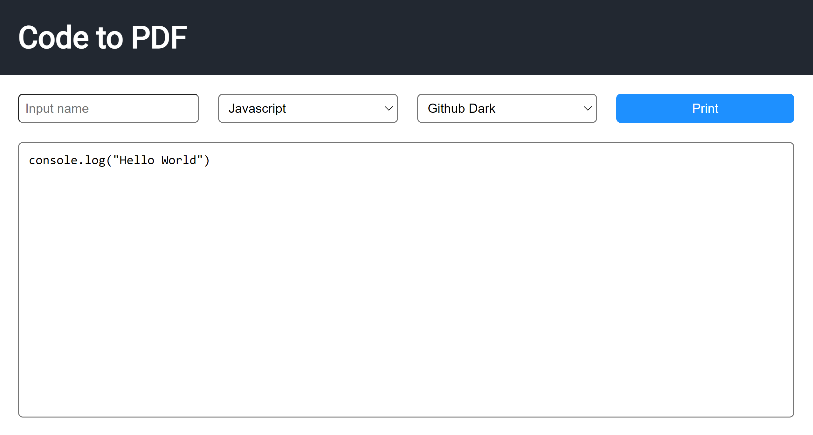

# Code to PDF Generator

Code to PDF is a website that allows users to paste source code and generate a PDF file with highlighted syntax. It is built using JavaScript and the highlight.js library.

## TODO
- [ ] Add lines for white theme to better see outline
- [ ] Improve button colors and sizing
- [ ] Add icon for website

## Features
- Text box to paste source code
- Syntax highlighting using the [highlight.js](https://highlightjs.org/) library
- Ability to select different themes and programming languages

## Usage
1. Visit [the website](https://tarikjaber.github.io/Code-to-PDF/)
2. Paste your source code into the text box
3. Select your desired theme and programming language
4. Click the "Generate PDF" button to download your PDF file

## Analytics
This site uses [counter.dev](https://counter.dev/) for
analytics. You view analytics for the site 
[here](https://counter.dev/dashboard.html?user=tarikjaber&token=oFh7AcrH-q0%3D).

